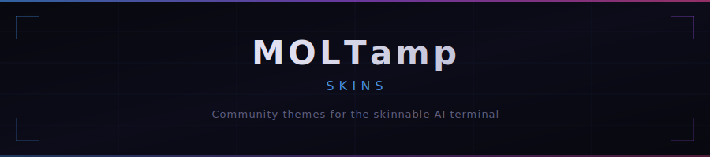

<div align="center">



<br/>
<br/>

[](LICENSE)
[](#browse-skins)
[](SKINNING.md)
[](https://moltamp.com/skinning/)

**[Download MOLTamp](https://moltamp.com)** &nbsp;&middot;&nbsp; **[Skinning Guide](SKINNING.md)**

</div>

<br/>

## What is MOLTamp?

MOLTamp wraps Claude Code's terminal in a skinnable cockpit UI — vibes panel, side panels, telemetry ticker, reactive animations. Everything responds to Claude's state through CSS. Think **Winamp for AI terminals**.

> Pure CSS. Zero JavaScript. Full creative freedom.

<br/>

## Browse Skins

<table>
<tr>
<td align="center" width="33%">

**Obsidian**<br/>
<sub>Clean dark default</sub>

</td>
<td align="center" width="33%">

**Phosphor**<br/>
<sub>Green CRT terminal</sub>

</td>
<td align="center" width="33%">

**Blade Runner**<br/>
<sub>Amber noir with rain</sub>

</td>
</tr>
<tr>
<td align="center">

**Deep Space**<br/>
<sub>Cyan space station</sub>

</td>
<td align="center">

**Kosmos**<br/>
<sub>Soviet space program</sub>

</td>
<td align="center">

**Biodiagnostic**<br/>
<sub>Teal medical/biotech</sub>

</td>
</tr>
<tr>
<td align="center">

**Ice Nine**<br/>
<sub>Frozen blue crystalline</sub>

</td>
<td align="center">

**LCARS**<br/>
<sub>Star Trek computer</sub>

</td>
<td align="center">

**Lunar**<br/>
<sub>Moon phase observatory</sub>

</td>
</tr>
<tr>
<td align="center">

**Neon Horizon**<br/>
<sub>Synthwave magenta/cyan</sub>

</td>
<td align="center" colspan="2">

*Your skin here* &rarr; [submit a PR](#contributing)

</td>
</tr>
</table>

<br/>

## Install

```bash
# Clone and copy
git clone https://github.com/shoot-here/moltamp-skins.git
cp -r moltamp-skins/skins/blade-runner ~/Moltamp/skins/
```

Or: **MOLTamp > Settings > Skins > Import** &rarr; select folder or `.zip`

<br/>

## Create a Skin

```
skins/my-skin/
  skin.json         <- manifest
  theme.css         <- all styles
  assets/           <- GIFs, images (optional)
```

### `skin.json`

```json
{
  "id": "my-skin",
  "name": "My Skin",
  "version": "1.0.0",
  "author": "Your Name",
  "description": "Short description.",
  "engine": "1.0"
}
```

### `theme.css`

```css
:root {
  /* Contract — required */
  --t-foreground: #e0e0e8;
  --t-background: #0a0a0f;
  --c-chrome-bg: #0a0a0f;
  --c-chrome-accent: #d4a036;

  /* Your palette — use --skin-* prefix */
  --skin-panel-bg: #070b07;
  --skin-overlay: rgba(7, 11, 7, 0.15);

  /* Custom effects — auto-appear as toggles in Settings */
  --effect-scanlines: 1;
  --effect-radar: 0.5;
}

/* Reactive — responds to Claude's state */
[data-activity="high"] .moltamp-vibes {
  filter: brightness(1.2) saturate(1.1);
}

/* Overlays — always include pointer-events: none */
.moltamp-vibes::before {
  content: '';
  position: absolute;
  inset: 0;
  background: var(--skin-overlay);
  pointer-events: none;
}
```

> **Full spec:** [SKINNING.md](SKINNING.md) &mdash; every variable, every class, reactive data, custom effects, AI prompt block.

<br/>

## The Rules

| # | Rule | Enforced |
|---|------|----------|
| 1 | All colors in `:root` as CSS variables | Validator |
| 2 | Override contract vars (`--t-*`, `--c-chrome-*`) | Convention |
| 3 | Custom vars use `--skin-*` prefix | Convention |
| 4 | No `background` on `.moltamp-vibes` | Preflight |
| 5 | `pointer-events: none` on `::before`/`::after` | Preflight |
| 6 | No external URLs, `@import`, or JS | Validator |
| 7 | Assets in `assets/`, max 5MB/file | Validator |

**Preflight** = MOLTamp auto-fixes it at load time. Your skin literally cannot break clicks, hovers, or drag handles.

<br/>

## Custom Effects

Any `--effect-*` variable in `:root` auto-appears in **Settings > Effects** as a toggle with intensity slider.

```css
:root {
  --effect-radar: 1;        /* "Radar" at 100% */
  --effect-heat-haze: 0;    /* "Heat Haze", off by default */
}

/* Control visibility with the variable */
.moltamp-vibes::before {
  opacity: var(--effect-radar);
  animation: sweep 4s linear infinite;
  pointer-events: none;
}
```

Nice labels via `skin.json`:

```json
{ "effects": { "radar": { "label": "Sonar Radar", "description": "Rotating sweep" } } }
```

<br/>

## Reactive Data

Skins react to Claude's live state via attributes on `.moltamp-shell`:

```css
/* Claude is thinking */
[data-shell-state="thinking"] .moltamp-terminal {
  box-shadow: inset 0 0 30px rgba(100, 200, 255, 0.1);
}

/* Heavy streaming */
[data-activity="high"] .moltamp-vibes {
  filter: brightness(1.3);
}

/* Context gauge as pie chart */
.moltamp-context-gauge {
  background: conic-gradient(
    var(--c-chrome-accent) calc(var(--data-context-pct) * 1%),
    var(--c-chrome-border) 0
  );
}
```

<details>
<summary><strong>All reactive attributes &amp; properties</strong></summary>

| Attribute | Values |
|-----------|--------|
| `data-activity` | `idle` `low` `high` |
| `data-shell-state` | `idle` `thinking` `streaming` `tool-use` `permission` `error` `complete` |
| `data-model` | Model name |

| CSS Property | Description |
|-------------|-------------|
| `--data-context-pct` | Context used (0-100) |
| `--data-cost-cents` | Session cost |
| `--data-tokens-in` | Input tokens (K) |
| `--data-tokens-out` | Output tokens (K) |
| `--data-rate-5h` | 5h rate limit (0-100) |
| `--data-agents` | Active subagents |
| `--data-git-changed` | Changed files |

</details>

<br/>

## Using AI

Point ChatGPT, Claude, or Codex at [SKINNING.md](SKINNING.md) — it has a ready-to-paste prompt block in the **"For AI-generated skins"** section.

MOLTamp's preflight system auto-fixes common AI mistakes, so generated skins work safely even when the AI misses a rule.

<br/>

## Contributing

1. Fork this repo
2. Create `skins/your-skin-id/` with `skin.json` + `theme.css`
3. Add a `preview.png` screenshot
4. [Open a PR](../../pulls)

See [CONTRIBUTING.md](CONTRIBUTING.md) for the full guide and checklist.

<br/>

<div align="center">

<sub>Made for the community by <a href="https://moltamp.com">MOLTamp</a></sub>

</div>
